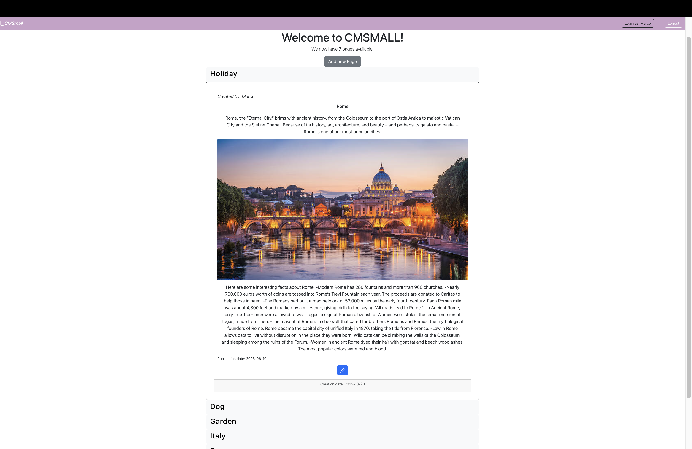

[](https://classroom.github.com/a/8AapHqUJ)

# Exam #1: "CSMall"
## Student: s309895 INTINI ALESSIA 

## React Client Application Routes

- Route `/`: this is homepage, where all pages are shown. In order of publication date and only if published if the user is not authenticated
- Route `/login`:contains login form
- Route `/pages`:this is the route to create new page and new blocks of the page
- Route `/pages/:id`:this is the route to update a page and its blocks
- Route `/pages/admin/title`:this is the route if user is an admin and he wants to edit website title

## API Server
- __GET__ `/` -Get the list of all the pages and if user is author of the page can do some operations
  - Response Status: `200` OK, `500` Internal Server Error
  - Response body:
  ```
    [
      {   "id_p":10,
          "title": "Rome",
          "author": "Marco",
          "creationDate": "2023-01-10",
          "publicationDate": "",
          "blocks": [
            {
              "id_p":10,
              "id_b":0
              "type":"header",
              "content":"Rome",
              "pos":0,
              "
            },
            {
              "id_p":10
              "id_b":1,
              "type":"Paragraph",
              "content":"",
              "pos":1
            }
          ]
      },
      {..}
      ...
    ]
  ```

- __POST__ `/api/pages/` - Create a new page
  - Prerequisite: User is logged in
  - Request body: 
    ```
    {
      title :  String - title of page
      publicationDate: date - when page is publicated (empty because it is a draft, date is in the future because it is scheduled and date is in the past and it is already published)
      Blocks: Block[] - List of block to be inserted into page
    }
    ```
  - Response Status: `201` Created, `401` Unauthorized, `422` Unprocessable entity (Bad body format), `503` Service Unavailable, `400` Bad request in db
  - Response Body: lastId of page


- __PUT__ `/api/pages/:id` - Edit the page of the current user, if he is the author
  - Prerequisite: User is logged in
  - Request body: 
    ```
    {
      title :  String - title of page

      publicationDate: date - when page is publicated (empty because it is a draft, date is in the future because it is scheduled and date is in the past and it is already published)

      newBlocks: Block[] - List of blocks to be inserted into page

      editableBlock: Block[]-List of blocks that are edited into page

      deleteBlocks:Block[]-List of blocks that are deleted 

    }
    ```
  - Response Status: `201` OK, `401` Unauthorized, `422` Unprocessable Entity, `503` Service Unavailable, `400` Bad request in db
  - Response Body: Blocks of page
  

- __PUT__ `/api/pages/:id` - Edit the page of the current user, if he is the admin he can also edit author of the page
  - Prerequisite: User is logged in and role is 'admin'
  - Request body: 
    ```
    {
      title :  String - title of page

      author: String - author of page

      publicationDate: date - when page is publicated (empty because it is a draft, date is in the future because it is scheduled and date is in the past and it is already published)

      newBlocks: Block[] - List of blocks to be inserted into page

      editableBlock: Block[]-List of blocks that are edited into page

      deleteBlocks:Block[]-List of blocks that are deleted 
    }
    ```
  - Response Status: `201` OK, `401` Unauthorized, `422` Unprocessable Entity, `503` Service Unavailable, `400` Bad request in db
  - Response Body: Blocks of page


- __DELETE__ `/api/pages/:id` - Delete the page of the current user, that is the author
  - Prerequisite: User is logged in
  - Request Body: __None__
  - Response Status: `200`ok, `401` Unauthorized, `503` Service Unavailable,`404`page not foud


- __POST__ `/api/pages/pages/title` - Edit the title of website
  - Prerequisite: User is logged in and he is an admin
  - Request body: 
    ```
    {
      id: Number - id of the title, is only one row
      titleAdmin :  String - title of website
    }
    ```
  - Response Status: `201` OK, `400` Bad request, `422` Unprocessable Entity, `503` Service Unavailable
  - Response Body: __None__

- __GET__ `/api/` -Get the list of all the pages and if user is author of the page can do some operations
  - Response Status: `200` OK, `500` Internal Server Error
  - Response body:
  ```
    [
     {
      id:Number -  id of the title, is only one row,
      titleAdmin:String - title that set admin
      titleDefault: String - default title
     }
    ]
  ```

  ### User login
- __POST__ `/api/sessions`
  - Method: POST
  - Description: logs the user in, checking provided credentials
  - Request body: an object containing the credentials provided by the login form
    ```
    {
      "username":"marco@polito.it",
      "password":"password"
    }
    ```
  - Response: `200 Ok` (if successful),  `401 Unauthorized` (login error)
  - Response body: some info on the logged user
    ```
    {
      "id":3,
      "username":"marco@polito.it",
      "name":"Marco"
    }
    ```
    
### User logout
- URL: '/api/sessions/current'
  - Method: DELETE
  - Description: logs the user out, deleting the session
  - Request body: _None_
  - Response: `200 Ok`
  - Response body: _None_

### Check login
- URL: '/api/sessions/current'
  - Method: GET
  - Description: check whether the user is logged in or not
  - Request body: _None_
  - Response: `200 Ok` (if successul), `401 Unauthorized` (if not logged in)
  - Response body: some info on the logged user
      ```
      {
          "id":3,
          "username":"marco@polito.it",
          "name":"Marco"
      }
      ```


## Database Tables

- Table `User` - contains information about users
- Table `Page` - contains information about pages
- Table `Block`-contains information about blocks of page
- Table `Title`-contain title of the website

## Main React Components

### NavBarComponent.jsx
- `NavBar` :enders the navbar and the icons at the top of the page

### AuthComponent.jsx
- `LoginForm`: contains perform to insert the credentials for login
(only _main_ components, minor ones may be skipped)

### ContextComponent.jsx
- `TitleProvider`: define a context to render the title when admin update it

### PageComponent.jsx
- `PageTable`: contains all pages after get to db
- `PageRow`: render all row for every page
- `BlockRow`: contains all blocks for every page and change visualization based on type of block

### PageFormComponent.jsx
- `PageForm`: contains all fields to add new pages and button
- `BlockOutput`: render all block that page contains if it is edited or the block that add. It contains all button to add, edit, delete or move every block.

### TitleFormComponent.jsx
- `TitleForm`: form to add new title of website, if user is an admin


## Screenshot




## Users Credentials

- username: marco@polito.it, password:password (author of three pages. One is published, one is a draft and one will be published in the future)

- username:luigi@polito.it , password:password (author of no page)

- username:alessia@polito.it , password:password (she is an admin)

- username:paolo@polito.it, password:password (author of two pages. One is published and  one will be published in the future)

- username:luca@polito.it, password:password (author of two pages, one is a draft and one is published)